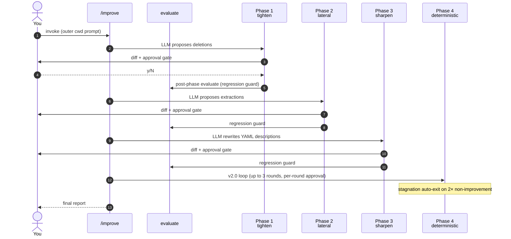

<div align="center">

# meta-harness

### A project-fit companion for Claude Code harnesses<br/>that *evolves alongside* your project's own lifecycle.

[](.claude-plugin/plugin.json)
[](LICENSE)
[](https://claude.com/claude-code)
[](CHANGELOG.md)

</div>

> **meta-harness** treats *your project* as the yardstick. There is no global
> rubric of "good harness". Instead, the plugin builds, evaluates, monitors,
> and iteratively improves a **per-project** harness — `CLAUDE.md`, `agents/`,
> `skills/`, `commands/`, `hooks/` — so that as the project grows from a
> Node.js script into a Next.js app into a polyglot service, the harness
> reshapes itself to match.

---

## Contents

- [At a glance](#at-a-glance)
- [Why per-project, not global?](#why-per-project-not-global)
- [The four commands](#the-four-commands)
- [The improve pipeline (v2.1)](#the-improve-pipeline-v21)
- [Install](#install)
- [Quick start](#quick-start)
- [How to read an evaluate report](#how-to-read-an-evaluate-report)
- [Opt-in hooks (default OFF)](#opt-in-hooks-default-off)
- [Safety contract](#safety-contract)
- [Architecture decisions](#architecture-decisions)
- [What this plugin is NOT](#what-this-plugin-is-not)

---

## At a glance

|                          |                                                                          |
| ------------------------ | ------------------------------------------------------------------------ |
| **System under test**    | Your *harness* — `CLAUDE.md`, `agents/`, `skills/`, `commands/`, `hooks/` |
| **What never gets touched** | Your application code                                                 |
| **Standard of fit**      | **The project itself** — not a universal rubric                          |
| **How it scores**        | LLM-as-judge fit findings, keyed to actual project shape                 |
| **Output**               | Strict JSON: coverage gaps · over-coverage · stale refs · pain patterns  |
| **Reproducibility**      | Each result embeds `(project_tree_hash, harness_state_hash)`             |
| **New network surface**  | Zero — only the Claude Code host's transport                             |
| **Disk safety**          | Atomic writes, cwd-guarded, snapshot rollback                            |

---

## Why per-project, not global?

A Claude Code harness that scores well in the abstract may still be the
**wrong** harness for *your* project. A solo Node.js script does not need
the same skills as a Next.js app, which does not need the same agents as a
multi-service Dart + Python repo.

A harness that doesn't move when the project moves becomes dead weight —
stale skills triggered by routes that no longer exist, agents fluent in a
framework you abandoned, refusal rules guarding directories that have been
renamed.

**meta-harness inverts the model.** Each project gets a project-local
harness that is:

- **Generated *from* the project's shape** · not a fixed template dump
- **Re-evaluated against the project's *current* state** · not yesterday's
- **Improved one finding at a time** · with a diff preview and your approval
- **Versioned alongside its code** · no hidden global state

The slogan: *the standard of a good harness is the project, not a rubric.*

---

## The four commands

Four slash commands, each a thin trigger over a procedural skill.

| Command                  | What it does                                                                                                | Side effects                                                       | Binds                |
| ------------------------ | ----------------------------------------------------------------------------------------------------------- | ------------------------------------------------------------------ | -------------------- |
| `/meta-harness:build`    | Scaffolds a project-tailored harness: 3-file core + per-finding stubs.                                      | Writes only on approval · cwd-guard · diff preview · outer gate.   | `M3 AC-1 AC-8`       |
| `/meta-harness:evaluate` | LLM-as-judge fit assessment of the current harness against the project.                                     | Emits strict JSON + short summary. No disk writes by default.      | `M2 AC-2 AC-6 AC-7`  |
| `/meta-harness:manage`   | Read-only LLM-free healthcheck: inventory, fit-drift via hash, internal lint.                               | Hook-callable. Optional `--write-report`.                          | `M4 AC-9`            |
| `/meta-harness:improve`  | 4-phase pipeline: **tighten → lateral → sharpen → deterministic**. Phases 1-3 are LLM with structural invariants; phase 4 is the v2.0 loop. | Per-phase approval gate + regression guard. AC-3 reproducibility via `--phases deterministic`. | `M5 AC-3 HR-5`       |

`build` and `improve` are the only commands that modify disk. `manage` is
hook-callable and LLM-free; `evaluate` is LLM-as-judge but read-only.

---

## The improve pipeline (v2.1)

v2.1 replaces v2.0's single deterministic loop with a **4-phase
pipeline**. Each phase has a narrow, eval-gated invariant — no phase
is allowed to free-form-rewrite a skill body (Hamel's evals-first
warning). See [ADR-0004](docs/adr/ADR-0004-phase-pipeline.md) for the
ordering rationale and per-phase invariants.

| # | Phase           | LLM? | Mutation surface                                                | Anti-regression                  |
|---|-----------------|------|-----------------------------------------------------------------|----------------------------------|
| 1 | **tighten**     | Yes  | Line **deletions only** (Anthropic's conciseness test)          | Post-phase evaluate → auto-revert on `actionable` rise |
| 2 | **lateral**     | Yes  | Move sections to `references/<topic>.md` (progressive disclosure) | same                             |
| 3 | **sharpen**     | Yes  | YAML `description` / `when_to_use` only (body untouched)        | same                             |
| 4 | **deterministic** | No | v2.0 catalog: stub / line-delete / file-delete                  | HR-5 stagnation streak; 3-round cap (AC-3) |



**`--phases` selects a subset.** Common patterns:

```bash
# Default — full 4-phase pipeline
/meta-harness:improve

# v2.0-compatible / AC-3 reproducible (pin for CI / golden tests)
/meta-harness:improve --phases deterministic --auto --max-rounds 3

# Subtract-only — no additive changes
/meta-harness:improve --phases tighten,lateral

# Description-only sharpen pass (highest-leverage field per Anthropic)
/meta-harness:improve --phases sharpen

# Dry-run any combo
/meta-harness:improve --no-apply
```

### Phase 4 deterministic catalog

The phase-4 proposer is deterministic by finding category:

| Finding category  | Proposed action                                                              |
| ----------------- | ---------------------------------------------------------------------------- |
| `coverage-gap`    | Generate `.claude/skills/<slug>/SKILL.md` or `.claude/agents/<slug>.md` stub |
| `pain-pattern`    | Same — coverage of a recurring friction.                                     |
| `stale-reference` | In-place edit removing the dead reference.                                   |
| `over-coverage`   | Move the file into `.meta-harness/snapshots/`.                               |

Stubs land in the `.claude/` canonical locations because the Claude Code
runtime auto-loads them from there. `evaluate` and `manage` enumerate
BOTH `.claude/{skills,agents,commands,hooks}/` AND the legacy top-level
counterparts, so older harnesses keep working.

---

## Install

Inside a Claude Code session:

```bash
/plugin marketplace add seokan-jeong/meta-harness
/plugin install meta-harness@meta-harness
```

| Step                | What happens                                                          |
| ------------------- | --------------------------------------------------------------------- |
| `marketplace add`   | Registers this repo as a marketplace catalog.                         |
| `plugin install`    | Installs the plugin defined in `.claude-plugin/plugin.json`.          |

After installation the four slash commands are available in any Claude Code
session.

---

## Quick start

At your project root:

```bash
# 1 ── Bootstrap a project-tailored harness
/meta-harness:build
#  → cwd guard prompt → analyzer-driven gap discovery →
#    diff preview → atomic write of (3-file core + per-finding stubs)

# 2 ── Get a fit-assessment
/meta-harness:evaluate
#  → JSON: findings by category × severity, qualitative bucket
#    (well-aligned / good / decent / draft)

# 3 ── Cheap healthcheck (no LLM cost)
/meta-harness:manage --json-only
#  → inventory + drift bit + lint warnings

# 4 ── Iteratively improve (4-phase pipeline by default)
/meta-harness:improve
#  → tighten → lateral → sharpen → deterministic
#  → each phase: diff preview + approval + post-phase regression guard

# 4b ── v2.0-compatible (deterministic phase only; AC-3 reproducible)
/meta-harness:improve --phases deterministic --auto --max-rounds 3
```

> All four commands respect a **cwd guard** (HR-3): they refuse to operate
> against `/`, `$HOME`, `/tmp`, or `/private/tmp`. `build` and `improve`
> additionally show an outer confirmation prompt before any disk write.

---

## How to read an evaluate report

```jsonc
{
  "schema_version": 1,
  "project_tree_hash":   "sha256:...",  // project shape at evaluate time
  "harness_state_hash":  "sha256:...",  // harness shape at evaluate time
  "evaluator_model_id":  "claude-opus-4-7",
  "fit_assessment": {
    "qualitative": "decent",           // well-aligned | good | decent | draft
    "actionable_findings": 5,
    "summary": "Auth flow has no skill coverage; obsolete React stubs found."
  },
  "findings": [
    {
      "id": "F-001",
      "category": "coverage-gap",       // coverage-gap | over-coverage | stale-reference | pain-pattern
      "severity": "high",               // high | medium | low
      "where": "lib/features/auth/",
      "evidence_ref": "lib/features/auth/login_controller.dart:42",
      "rationale": "Authentication logic spans 6 files with no SKILL.md coverage; recurring pain pattern in commit history.",
      "suggested_action": "Generate .claude/skills/auth-flow/SKILL.md"
    }
  ]
}
```

Each finding includes an `evidence_ref` pointing to a real file path or
file:line in the project. The evaluator skill validates evidence refs
exist before returning the JSON (no hallucinated paths).

> **Reproducibility floor** — with the same `(project_tree_hash,
> harness_state_hash)` pair and evaluator model, three consecutive
> `evaluate` runs produce the same set of high-severity findings (low and
> medium may vary by ≤ 1 each).

---

## Opt-in hooks (default OFF)

The plugin ships two hook scripts under `hooks/` but the plugin's
`plugin.json` intentionally omits a `hooks` field per
[ADR-0003](docs/adr/ADR-0003-slash-plus-optin-hooks.md). Hook-triggered
runs of `manage` or `evaluate` write to disk and (for `evaluate`) cost
LLM tokens — the operator must consciously register them in their own
`settings.json`. The hook scripts themselves additionally hard-check
for `.meta-harness/` and `exit 0` silently on non-harnessed projects,
so the registration is the only meaningful opt-in step.

<details>
<summary><b>How to enable, where reports land, and how to roll back</b></summary>

### Enable

Copy the entries from `hooks/hooks.json` (a real-schema sample) into
your own `~/.claude/settings.json` (global) or `<project>/.claude/settings.json`
(project-local):

```jsonc
// ~/.claude/settings.json
{
  "hooks": {
    "SessionStart": [
      {
        "hooks": [
          {
            "type": "command",
            "command": "${CLAUDE_PLUGIN_ROOT}/hooks/session-start-healthcheck.sh"
          }
        ]
      }
    ],
    "Stop": [
      {
        "hooks": [
          {
            "type": "command",
            "command": "${CLAUDE_PLUGIN_ROOT}/hooks/stop-evaluate.sh"
          }
        ]
      }
    ]
  }
}
```

`${CLAUDE_PLUGIN_ROOT}` resolves at hook-execution time to this plugin's
install path.

Both hooks are **idempotent and harness-detecting** — they silently
`exit 0` if the cwd is not a meta-harness-built project (signal:
`.meta-harness/` directory must exist alongside `CLAUDE.md` or
`.claude/agents/project-fit-analyzer.md`). So registering them globally is safe.

### Where reports land

```text
.meta-harness/
├── state.json                          ← project_tree_hash record
├── reports/
│   ├── 2026-05-26T12-00-00Z-manage.json
│   └── 2026-05-26T12-00-00Z-evaluate.json
├── .improve-state.json                 ← rolling round-state for /improve
└── snapshots/
    └── 2026-05-26T12-00-00Z/            ← rollback target
        ├── CLAUDE.md
        ├── agents/...
        └── ...
```

The `.meta-harness/.gitignore` shipped by `build` contains a single `*`,
so the entire directory stays out of git by default.

### Manual rollback

There is no dedicated `/meta-harness:rollback` command. To undo the last
`/build` or `/improve` apply, copy the matching snapshot back over the
working tree from the project root:

```bash
cp -R .meta-harness/snapshots/<UTC>/. .
```

> The trailing `/.` copies hidden files too.

</details>

---

## Safety contract

| Guard                | What it does                                                                                                                                              | Bound to       |
| -------------------- | --------------------------------------------------------------------------------------------------------------------------------------------------------- | -------------- |
| **Secret deny-list** | `.env*`, `id_rsa*`, `*.pem`, `*.key`, `credentials.*`, `secrets.*` never enter analyzer input. Output content is post-scanned for 16+ char base64/hex blobs. | `HR-4 AC-7`    |
| **Cwd guard**        | Refuses `/`, `$HOME`, `/tmp`, `/private/tmp`. Symlinks resolved with `pwd -P`.                                                                            | `HR-3`         |
| **Atomic write**     | All disk writes use `.tmp.$$` → `mv`. Build/improve snapshot pre-overwrite files under `.meta-harness/snapshots/<UTC>/`.                                  | `HR-1`         |
| **Cap + stagnation** | Improve never runs > 3 rounds; 2 consecutive `delta_actionable ≥ 0` auto-exits.                                                                            | `AC-3 HR-5`    |
| **Injection guard**  | Project and harness file content is fed to the analyzer as **data**, not as instructions.                                                                  | `HR-2`         |

> **Threat model for HR-4** — local defense-in-depth, *not* an API-transport
> guard. The Claude Code host handles transport; meta-harness adds no new
> network surface. AC-7 binds the contract: a dummy `API_KEY=test123` in a
> fixture must not appear in any output.

---

## Architecture decisions

| ADR                                                                  | Title                       | The question it answers                                              |
| -------------------------------------------------------------------- | --------------------------- | -------------------------------------------------------------------- |
| [ADR-0003](docs/adr/ADR-0003-slash-plus-optin-hooks.md)              | Slash + opt-in hooks        | Why are slash commands primary and hooks default-OFF?                |
| [ADR-0004](docs/adr/ADR-0004-phase-pipeline.md)                      | Phase pipeline for improve  | Why `tighten → lateral → sharpen → deterministic`? Why eval-gated invariants per phase rather than free-form rewrites? |

> v1.0's ADR-0001 (static-KB choice) and ADR-0002 (single-evaluator agent)
> are retired in v2 — the static KB itself was retired, and the single
> agent rationale collapsed into the project-fit-analyzer's design.

---

## What this plugin is NOT

| It is **NOT**                              | It **IS**                                                                            |
| ------------------------------------------ | ------------------------------------------------------------------------------------ |
| A code-quality linter                      | A *harness*-fit assessor                                                             |
| A team-collaboration / onboarding tool     | A per-project lifecycle companion                                                    |
| A runtime agent / background daemon        | Invoked-only — slash command or opt-in hook                                          |
| A Karpathy or Anthropic endorsement        | A working synthesis of their public writing — neither has reviewed or approved this plugin |
| A universal rubric                         | Project-keyed — the standard *is* this project, not a checklist                      |

---

## Reporting issues & contributing

Issues and contributions are welcome at
[github.com/seokan-jeong/meta-harness](https://github.com/seokan-jeong/meta-harness).

---

## License

[MIT](LICENSE) © seokan-jeong
