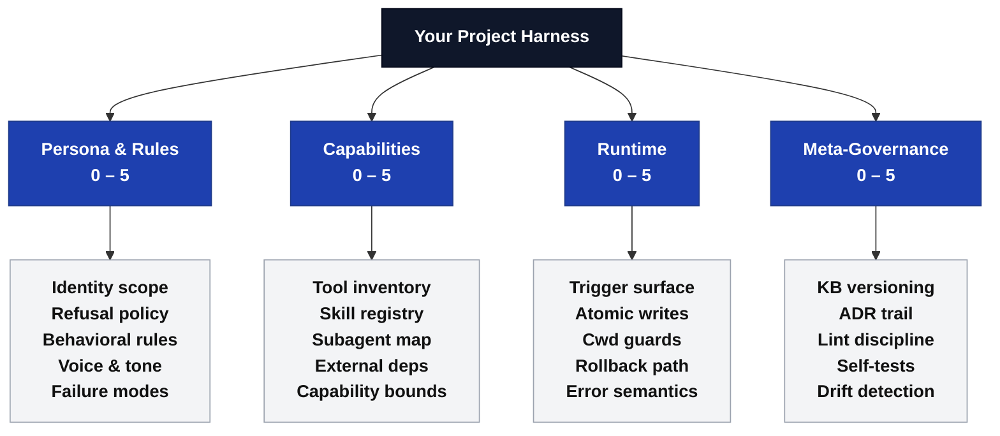
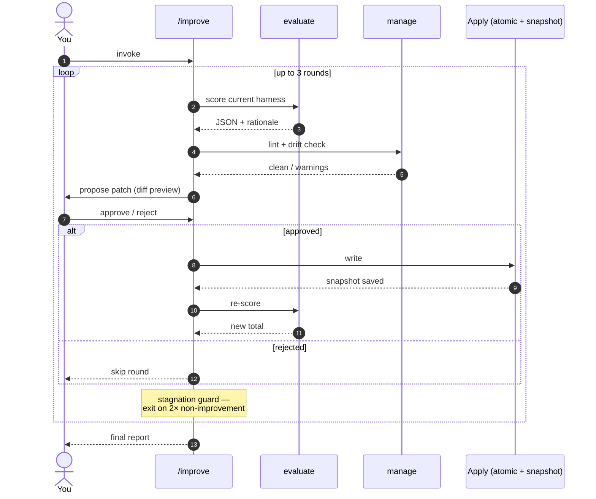

<div align="center">

# meta-harness

### Score, build, and improve project-level Claude Code harnesses<br/>against a curated theory of *what a good harness looks like*.

[](.claude-plugin/plugin.json)
[](docs/kb-manifest.json)
[](LICENSE)
[](https://claude.com/claude-code)
[](CHANGELOG.md)

</div>

> **meta-harness** treats *your project* as the system under test. It does not modify your code — it inspects the structural scaffolding around your code (`CLAUDE.md`, agent definitions, skill registry, hooks, governance docs) and grades that scaffolding against a rubric synthesized from **Karpathy's context-engineering writing**, **Anthropic's agentic-loops guidance**, and a derived **4-bucket framework**.

---

## Contents

- [At a glance](#at-a-glance)
- [Why project-level, not global?](#why-project-level-not-global)
- [The 4-bucket rubric](#the-4-bucket-rubric)
- [The four commands](#the-four-commands)
- [The improve loop](#the-improve-loop)
- [Install](#install)
- [Quick start](#quick-start)
- [How to read an evaluate report](#how-to-read-an-evaluate-report)
- [Knowledge base versioning](#knowledge-base-versioning)
- [Opt-in hooks (default OFF)](#opt-in-hooks-default-off)
- [Safety contract](#safety-contract)
- [Architecture decisions](#architecture-decisions)
- [What this plugin is NOT](#what-this-plugin-is-not)

---

## At a glance

|                          |                                                                          |
| ------------------------ | ------------------------------------------------------------------------ |
| **System under test**    | Your *harness* — `CLAUDE.md`, `agents/`, `skills/`, `hooks/`, governance |
| **What never gets touched** | Your application code                                                 |
| **How it scores**        | LLM-as-judge against a static, versioned KB                              |
| **Score shape**          | 4 axes × 5 criteria = 20 criteria, total `0–20`                          |
| **Output**               | Strict JSON + criterion-cited rationale                                  |
| **Reproducibility**      | Each result embeds the exact `kb_manifest_hash` used                     |
| **New network surface**  | Zero — only the Claude Code host's transport                             |
| **Disk safety**          | Atomic writes, cwd-guarded, snapshot rollback                            |

---

## Why project-level, not global?

Global `~/.claude/` harnesses encode *your* habits across all projects. They drift, they collide with team conventions, and they make it hard to onboard collaborators who don't share your tooling.

**meta-harness inverts the model** — each project gets a project-local harness that is:

- **Versioned alongside its code** · no hidden global state
- **Customized to its stack** · Python, Rust, Flutter, whatever shape the project takes
- **Verifiable against a shared rubric** · same yardstick, different shapes

---

## The 4-Bucket Rubric

Every harness is scored on four axes, each with five criteria.



> A fresh `/meta-harness:build` typically scores **12–14 / 20** out of the box.
> The design floor: `PER-3 ≥ 4/5` because the persona template ships pre-filled with four behavioral rules.

---

## The four commands

Four slash commands, each a thin trigger over a procedural skill.

| Command                  | What it does                                                                                          | Side effects                                                       | Binds                |
| ------------------------ | ----------------------------------------------------------------------------------------------------- | ------------------------------------------------------------------ | -------------------- |
| `/meta-harness:build`    | Bootstraps a complete 4-bucket harness from bundled templates.                                        | Writes 9 files · cwd-guard · diff preview · outer approval gate.   | `M3 AC-1 AC-8`       |
| `/meta-harness:evaluate` | Scores the current harness on 4 axes via LLM-as-judge.                                                | Emits strict JSON + short summary. No disk writes by default.      | `M2 AC-2 AC-6 AC-7`  |
| `/meta-harness:manage`   | Read-only healthcheck: bucket presence, KB drift, internal lint.                                      | Hook-callable. Optional `--write-report`.                          | `M4 AC-9`            |
| `/meta-harness:improve`  | Iterative 3-round loop: evaluate → propose → approve → atomic apply → re-evaluate.                    | Stagnation auto-exit at 2 consecutive non-improvements.            | `M5 AC-3 HR-5`       |

All four commands invoke a single LLM-as-judge evaluator agent (`agents/karpathy-evaluator.md`) directly or transitively.

---

## The improve loop



---

## Install

Inside a Claude Code session:

```bash
/plugin marketplace add seokan-jeong/meta-harness
/plugin install meta-harness@meta-harness
```

| Step                | What happens                                                          |
| ------------------- | --------------------------------------------------------------------- |
| `marketplace add`   | Clones this repo as a marketplace catalog                             |
| `plugin install`    | Installs the plugin defined in `.claude-plugin/plugin.json`           |

After installation the four slash commands are available in any Claude Code session.

---

## Quick start

Once installed, at your project root:

```bash
# 1 ── Bootstrap a complete harness into the current project
/meta-harness:build
#  → cwd guard prompt → diff preview → atomic write of 9 files

# 2 ── Score it
/meta-harness:evaluate
#  → JSON: 4-axis scores 0–5, total 0–20, criterion-by-criterion rationale

# 3 ── Healthcheck without re-scoring (cheap, no LLM cost)
/meta-harness:manage --json-only
#  → bucket presence + KB drift + lint warnings

# 4 ── Iteratively improve
/meta-harness:improve
#  → up to 3 rounds, each with a diff preview + your approval before apply
```

> All four commands respect a **cwd guard** (HR-3): they refuse to operate against `/`, `$HOME`, `/tmp`, or `/private/tmp`. `build` and `improve` additionally show an outer confirmation prompt before any disk write.

---

## How to read an evaluate report

```jsonc
{
  "kb_manifest_hash":   "sha256:...",        // ← pins reproducibility
  "evaluator_model_id": "claude-opus-4-7",
  "axes": {
    "persona":      { "score": 4, "rationale": "..." },
    "capabilities": { "score": 3, "rationale": "..." },
    "runtime":      { "score": 4, "rationale": "..." },
    "meta_gov":     { "score": 3, "rationale": "..." }
  },
  "total": 14
}
```

Each `rationale` must cite at least one KB criterion ID (e.g. `KB-3 PER-4` for *"Persona & Rules bucket has explicit scope-and-refusal statement"*). The validator (`scripts/validate-eval-output.sh`) enforces:

| Check                          | Rule                                                |
| ------------------------------ | --------------------------------------------------- |
| Rationale length               | ≥ 80 characters                                     |
| Criterion citation             | must match regex (`KB-\d+ \w+-\d+` or similar)      |
| Vacuous "looks good" rationale | rejected at parse time                              |

> **Reproducibility floor** — with the same KB manifest hash and project input, three consecutive `evaluate` runs produce per-axis scores within `max − min ≤ 2` and a total within `±2`.

---

## Knowledge base versioning

> **TL;DR** — plugin SemVer tracks code changes; KB `set_version` tracks rubric-content changes. **They are decoupled** so that six-month-old evaluate results stay reproducible.

```text
 ┌──────────────────────────────────────────────────────────────────┐
 │   plugin v1.0.1   ←─  .claude-plugin/plugin.json   (code/schema) │
 │   KB     v1.0.0   ←─  docs/kb-manifest.json        (rubric/data) │
 └──────────────────────────────────────────────────────────────────┘
                                ↓
            Every evaluate result embeds kb_manifest_hash —
            one sha256 string pins the exact rubric used at
            scoring time, even after the plugin upgrades.
```

In v1.0.0 a redundant `kb` field was mirrored into `plugin.json`, but it was **dropped in v1.0.1** because the official Claude Code plugin schema does not parse it. The manifest remains the single source of truth.

**KB sources currently bundled:**

| Path                                                  | Contains                                                  |
| ----------------------------------------------------- | --------------------------------------------------------- |
| `docs/theory/karpathy-context-engineering.md`         | 9 principles                                              |
| `docs/theory/anthropic-agentic-loops.md`              | 8 principles                                              |
| `docs/theory/harness-4-bucket-principles.md`          | The master rubric — 4 axes × 5 criteria = 20 criteria     |

When the KB is refreshed (e.g. to incorporate a new Karpathy talk), the KB version bumps independently and `CHANGELOG.md` records the bump under a separate `KB` heading.

---

## Opt-in hooks (default OFF)

The plugin ships two hook scripts under `hooks/` but both are registered with `enabled: false` per [ADR-0003](docs/adr/ADR-0003-slash-plus-optin-hooks.md). Hook-triggered runs of `manage` or `evaluate` write to disk and (for `evaluate`) cost LLM tokens — the operator should consciously opt in.

<details>
<summary><b>How to enable, where reports land, and how to roll back</b></summary>

### Enable

```jsonc
// hooks/hooks.json
{
  "hooks": [
    { "name": "session-start-healthcheck", "enabled": true, /* ... */ },
    { "name": "stop-evaluate",             "enabled": true, /* ... */ }
  ]
}
```

Both hooks are **idempotent and harness-detecting** — they silently `exit 0` if the cwd is not a meta-harness-built project (signal: `.meta-harness/` directory must exist alongside `CLAUDE.md` or `agents/karpathy-evaluator.md`). So flipping them on globally is safe.

### Where reports land

```text
.meta-harness/
├── reports/
│   ├── 2026-05-26T12-00-00Z-manage.json
│   └── 2026-05-26T12-00-00Z-evaluate.json
└── .snapshot/
    └── 2026-05-26T12-00-00Z/   ← rollback target
        ├── CLAUDE.md
        ├── agents/...
        └── ...
```

Add both to your project's `.gitignore`:

```gitignore
.meta-harness/reports/
.meta-harness/.snapshot/
```

### Manual rollback (v1.0.1)

There is no dedicated `/meta-harness:rollback` command in v1.0.1. To undo the last `/build` or `/improve` apply, copy the matching snapshot back over the working tree from the project root:

```bash
cp -R .meta-harness/.snapshot/<UTC>/. .
```

> The trailing `/.` copies hidden files too. A dedicated rollback command is a v1.1 candidate.

### Atomic-write asymmetry (v1.0.1)

| Hook                       | Write path                                        | Atomic? |
| -------------------------- | ------------------------------------------------- | ------- |
| `session-start-healthcheck` | routes through `/meta-harness:manage --write-report` | ✓ `.tmp.$$` → `mv` |
| `stop-evaluate`            | stdout redirect (no `--write-report` yet)         | ✗ partial JSON possible on mid-stream failure |

Both hooks are default-OFF, so the blast radius is bounded. **v1.1 will add `--write-report` to evaluate and symmetrize the hook.**

</details>

---

## Safety contract

| Guard                | What it does                                                                                                                                              | Bound to       |
| -------------------- | --------------------------------------------------------------------------------------------------------------------------------------------------------- | -------------- |
| **Secret deny-list** | `.env`, `id_rsa`, `.git/`, regex matches never enter evaluator input. Defends against a hardcoded secret being verbatim-echoed into a persisted rationale. | `HR-4 AC-7`    |
| **Cwd guard**        | Refuses `/`, `$HOME`, `/tmp`, `/private/tmp`. Symlinks resolved with `pwd -P`.                                                                            | `HR-3`         |
| **Atomic write**     | All disk writes use `.tmp.$$` → `mv`. Build/improve snapshot pre-overwrite files under `.meta-harness/.snapshot/<UTC>/`.                                  | `HR-1`         |
| **Cap + stagnation** | Improve never runs > 3 rounds; 2 consecutive non-improvements auto-exit.                                                                                  | `AC-3 HR-5`    |

> **Threat model for HR-4** — local defense-in-depth, *not* an API-transport guard. The Claude Code host handles transport; meta-harness adds no new network surface. AC-7 binds the contract: a dummy `API_KEY=test123` in a fixture must not appear in any output.

---

## Architecture decisions

Three ADRs document the load-bearing design choices.

| ADR                                                                  | Title                       | The question it answers                                              |
| -------------------------------------------------------------------- | --------------------------- | -------------------------------------------------------------------- |
| [ADR-0001](docs/adr/ADR-0001-static-kb-choice.md)                    | Static curated KB           | Why bundle the KB instead of fetching it dynamically?                |
| [ADR-0002](docs/adr/ADR-0002-single-evaluator-agent.md)              | Single evaluator agent      | Why one shared agent, not per-axis specialists?                      |
| [ADR-0003](docs/adr/ADR-0003-slash-plus-optin-hooks.md)              | Slash + opt-in hooks        | Why are slash commands primary and hooks default-OFF?                |

---

## What this plugin is NOT

| It is **NOT**                              | It **IS**                                                                            |
| ------------------------------------------ | ------------------------------------------------------------------------------------ |
| A code-quality linter                      | A *harness*-quality scorer                                                           |
| A runtime agent / background daemon        | Invoked-only — slash command or opt-in hook                                          |
| A Karpathy or Anthropic endorsement        | A synthesis of their *public* writing — neither has reviewed or approved this plugin |
| A one-shot benchmark                       | Designed for re-checks over time; KB versioning keeps long-term comparisons honest   |

---

## Reporting issues & contributing

Issues and contributions are welcome. KB versioning means: if you want to add a new principle, you bump the **KB version** and update `docs/kb-manifest.json` — the plugin's SemVer is independent.

---

## License

[MIT](LICENSE) © seokan-jeong
